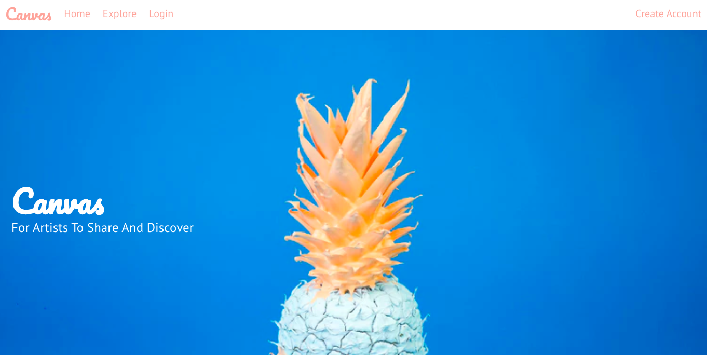
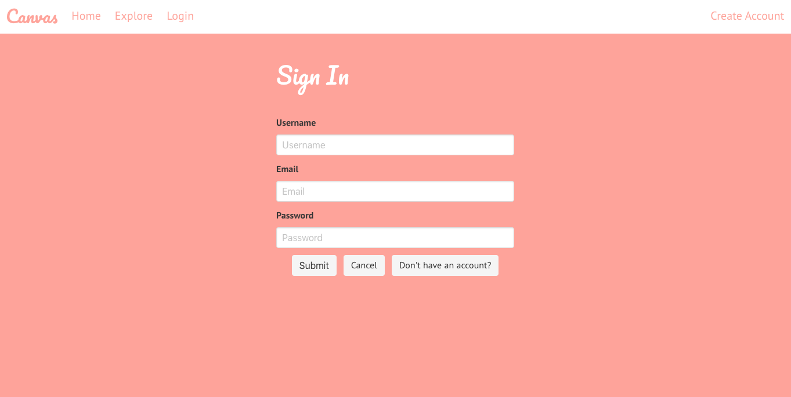
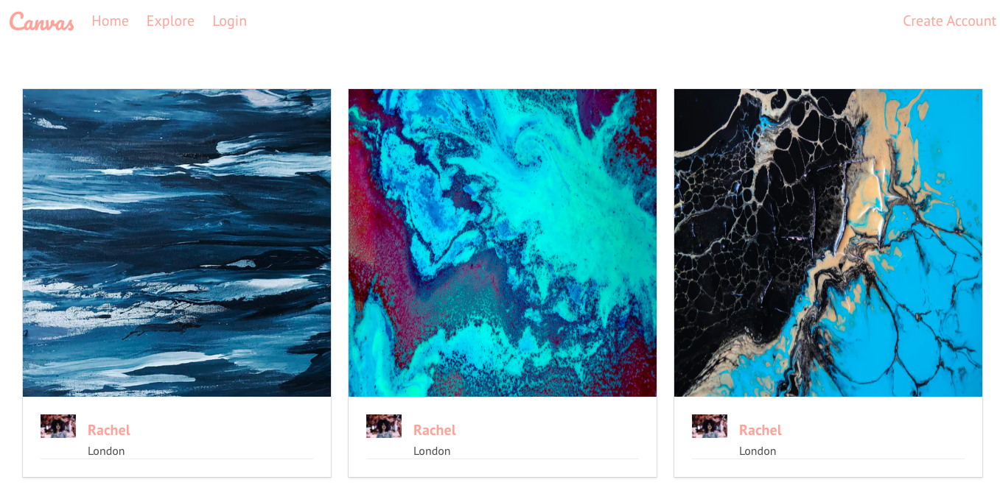

# GA WDI-34  Project #2: A Full-stack Application
## Canvas

For our second project we had a total of 7 days to build a full-stack RESTful application using Express and EJS which includes authentication.

 ### Project Brief

 * **Have at _least_ 2 models** – one representing a user and one that represents the main resource of your app, e.g. Restaurants
 * **Include relationships** - embedded or referenced. Make sure you take the time to consider the best approach before building out your models.
 * **The app should include authentication** - with encrypted passwords & an authorization flow.
 * **Have complete RESTful routes** for at least one of your resources with all CRUD actions.
 * **You must use SCSS** - as this is a key industry skill.
 * **Include wireframes** - that you designed before building the app.
 * Have **semantically clean HTML** - you make sure you write HTML that makes structural sense rather than thinking about how it might look, which is the job of CSS.
 * **Be deployed online** and accessible to the public.

### Technologies

* HTML5
* CSS3 & SCSS
* Bulma
* Javascript
* Express
* Node.js
* MongoDB
* Mongoose
* EJS
* bcrypt
* Git
* Github

---

###### Landing page

I built Canvas, a community driven site for artists to share their work and discover other artists for collaboration, inspiration and to showcase their skills.

Visit site: https://wdi-project-2-canvas.herokuapp.com/

###### The app uses session based authentication

---

 ### The Build

My first project taught me the importance of planning as thoroughly as possible in order to avoid scope creep, especially as this was my first experience of building a full-stack application. Having said that, building out a full front and back end application after just a week of learning took me longer than I'd anticipated.

I wanted to build an app that allowed users not only to discover art but to discover other artists, so it was key for users to be able to see each other's profiles and to be able to showcase anything they posted on their own profile so they could build a curated presence.

###### Users can explore all of the art uploaded onto the site and see the username of the person who uploaded it and where they're based.

In order to do this I had two models - one for "pictures" (art) and the other for users. This project was the first time I used Virtuals in order to populate a user's profile page with pictures they've posted, which was one of my highlights on this project.

---

 ### Learnings

I underestimated how long it would take to reach MVP, meaning that some of the features I'd planned (e.g. having the ability to "like" or "favourite" posts from other users), I was unable to implement due to time constraints.

---

 ### Extra Features

Moving forward there are a few features that I think would be good to add.

* Allow users to follow other users - number of followers/following displayed on profile
* Users can "like" a particular post which will then appear on their profile
* Error messages displayed to the user - e.g. at login, trying to comment without being logged in.

---
